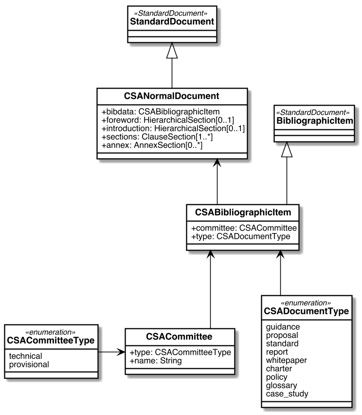

= Metanorma CSA Normal Document ("CSAND") Models

This is where we keep the Metanorma CSAND model definitions.

The CSA Normal Document ("CSAND") format is an instance of the
https://github.com/riboseinc/metanorma-model-standoc[Metanorma StandardDocument model].
Details of the general model can be found on its page.

== CSA Normal Document Model

